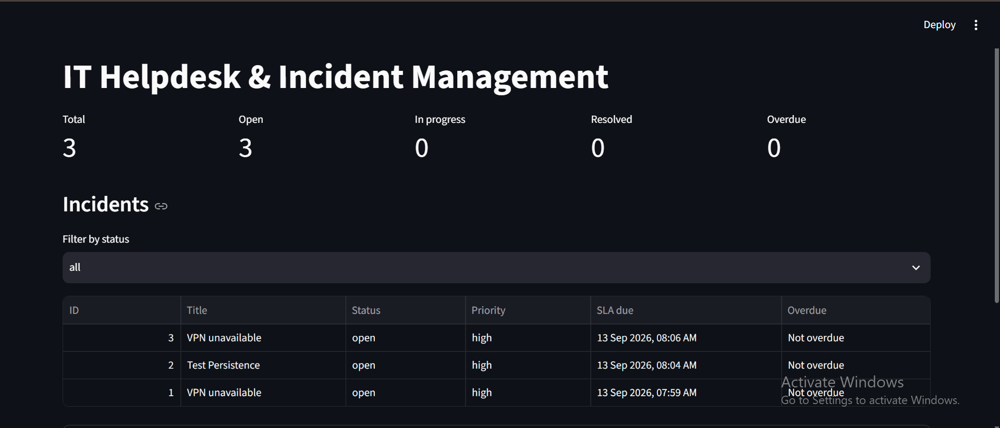
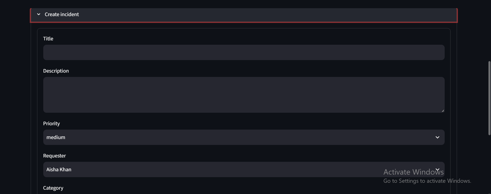
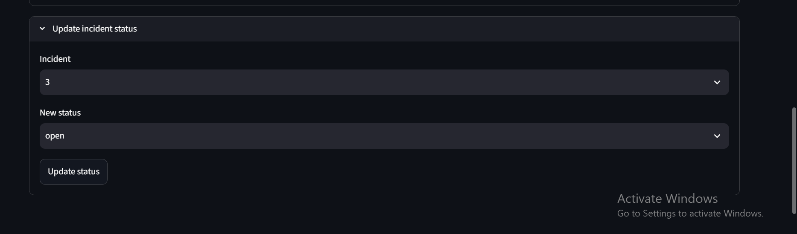

# IT Helpdesk & Incident Management System

An interview-focused MVP for recording, assigning, tracking, and resolving IT
support incidents. The project demonstrates relational database design, REST
API development, validation, business rules, SLA calculation, a service layer,
and basic automated testing.

> **Accuracy note:** This README describes the current codebase. Priority is
> selected directly by the incident creator; there are currently no separate
> impact or urgency fields. Incident events now persist creation, update,
> status-change, and comment actions, but the event record does not yet include
> an actor or a complete before/after snapshot.

---

## 1. Project Overview

### What the application does

The system allows a helpdesk team to:

- Create, view, update, filter, and delete incidents.
- Record a requester, category, priority, and optional support assignee.
- Move an incident through a controlled status lifecycle.
- Add and retrieve comments.
- Calculate and store an SLA deadline based on priority.
- Identify incidents as `"Overdue"` or `"Not overdue"`.
- View operational counts and incident data through a Streamlit dashboard.

The backend exposes a FastAPI REST API, while the Streamlit frontend consumes
that API over HTTP. SQLAlchemy maps the relational data to a SQLite database.

### Application Screenshots

#### Dashboard



#### Create Incident



#### Update Incident



### Real-world problem

IT support teams need a consistent way to capture user problems, assign work,
track progress, and determine whether response or resolution targets are being
met. Without a central incident record, requests can be lost in email or chat,
ownership is unclear, and support performance is difficult to measure.

### Who would use it?

- **Requesters:** report technical problems.
- **Support agents:** investigate, update, comment on, and resolve incidents.
- **Helpdesk coordinators:** assign work and monitor priorities and SLA status.
- **Interviewers and reviewers:** evaluate practical backend, database, and
  problem-solving skills.

The current MVP does not implement login or enforce user permissions. The roles
stored in the database are used for assignment validation, not authentication.

### Why incident management matters

Incident management helps an organization restore normal service quickly,
preserve ownership, prioritize urgent work, and measure whether service targets
are met. Even this small application demonstrates those concepts through
status transitions, assignees, priorities, timestamps, comments, and SLA
deadlines.

---

## 2. Problem Statement

### Business problem

Small IT teams need a lightweight system to manage technical issues from
creation through resolution. A useful MVP must answer:

1. What problem was reported?
2. Who reported it?
3. Which category does it belong to?
4. How urgent is it from a priority perspective?
5. Who owns the work?
6. What is its current lifecycle status?
7. When is the SLA deadline?
8. Has the deadline been missed?

### Solution

This project stores each incident in a normalized relational database and
exposes operations through a REST API. Pydantic schemas validate request data.
The service layer validates references, controls status transitions, calculates
SLA deadlines, and determines overdue status. Streamlit provides a small
operational dashboard without bypassing the API.

---

## 3. Requirements

### Functional requirements implemented

- Create and list users.
- Retrieve a user by ID.
- Create and list categories.
- Create incidents.
- List incidents with optional filters.
- Retrieve an incident by ID.
- Update incident details.
- Change incident status.
- Delete incidents.
- Add comments to incidents.
- List comments for an incident.
- Validate requester, category, and assignee references.
- Allow only agents or admins to be assigned.
- Calculate and store an SLA deadline at creation.
- Recalculate the SLA deadline if priority is updated.
- Report `"Overdue"` or `"Not overdue"`.
- Treat a resolved incident as overdue based on its `resolved_at` timestamp,
  rather than the time at which it is viewed.
- Display dashboard counts for total, open, in-progress, resolved, and overdue
  incidents.

### Non-functional requirements implemented or targeted

- **Modular design:** routers, schemas, models, services, and UI are separate.
- **Relational integrity:** foreign keys and unique constraints are declared.
- **Input validation:** FastAPI and Pydantic validate request payloads.
- **Readable API:** FastAPI generates OpenAPI/Swagger documentation.
- **Small MVP footprint:** SQLite and Streamlit keep local setup simple.
- **Testability:** business logic is separated into functions that can be
  tested without running the UI.

The current codebase does not implement authentication, authorization,
pagination, distributed deployment, background workers, or a formal migration
system.

---

## 4. Tech Stack

| Technology | Why it is used |
|---|---|
| **Python** | Productive, readable language with strong web, database, and testing ecosystems. |
| **FastAPI** | Provides typed REST endpoints, dependency injection, HTTP errors, and generated API documentation. |
| **Streamlit** | Enables a simple Python-only dashboard without introducing a separate JavaScript frontend. |
| **SQLAlchemy** | Provides ORM models, relationships, constraints, sessions, and database abstraction. |
| **SQLite** | Zero-configuration relational database suitable for a local two-hour MVP. |
| **pytest** | Runs focused unit-style and API tests with concise assertions. |
| **Uvicorn** | ASGI server used to run the FastAPI application. |
| **Requests** | HTTP client used by the Streamlit frontend to call the API. |

### Why heavier technologies were intentionally avoided

This MVP is intentionally a single application using SQLite. React, Node.js,
Docker, Kubernetes, Redis, Kafka, authentication providers, and microservices
would add setup and operational complexity without improving the core learning
objectives within a strict two-hour scope. They could be introduced later for
production requirements, but they are not needed to demonstrate CRUD,
relational modeling, REST, validation, lifecycle rules, or SLA logic.

---

## 5. System Architecture

```text
+----------------------+
|     Streamlit UI     |
+----------------------+
           |
           | HTTP requests
           v
+----------------------+
|  FastAPI REST API    |
+----------------------+
           |
           v
+----------------------+
| Service / Business   |
| Logic                |
+----------------------+
           |
           v
+----------------------+
| SQLAlchemy ORM       |
+----------------------+
           |
           v
+----------------------+
| SQLite               |
+----------------------+
```

### Layer responsibilities

#### Streamlit UI

The UI loads users, categories, and incidents through HTTP calls. It displays
metrics and an incident table, and provides forms for creating incidents and
changing status. It does not access SQLAlchemy or SQLite directly.

#### FastAPI REST API

The API layer maps HTTP methods and URLs to Python functions. It accepts
validated request bodies, returns response models, applies HTTP status codes,
and exposes Swagger documentation.

#### Service/business logic

`services.py` contains reusable rules for:

- Priority-to-SLA duration mapping.
- SLA deadline calculation.
- Overdue determination.
- Human-readable SLA status.
- Referential validation.
- Allowed status transitions.

#### SQLAlchemy

SQLAlchemy defines the database schema through Python classes, handles
relationships, creates queries, and manages sessions and transactions.

#### SQLite

SQLite persists users, categories, incidents, and comments in
`data/helpdesk.db`.

---

## 6. Project Structure

```text
IT-Helpdesk-Incident-System/
|
├── backend/
│   ├── app/
│   │   ├── __init__.py
│   │   ├── main.py
│   │   ├── database.py
│   │   ├── models.py
│   │   ├── schemas.py
│   │   ├── services.py
│   │   └── routers/
│   │       ├── __init__.py
│   │       ├── health.py
│   │       ├── incidents.py
│   │       └── users.py
│   │
│   └── tests/
│       ├── __init__.py
│       ├── test_api.py
│       └── test_sla.py
│
├── frontend/
│   └── streamlit_app.py
│
├── data/
│   └── helpdesk.db
│
├── requirements.txt
└── README.md
```

### Important files

- `backend/app/main.py`: creates the FastAPI application, initializes the
  database at startup, and registers routers.
- `backend/app/database.py`: configures the SQLite engine, sessions, base
  class, table creation, and seed data.
- `backend/app/models.py`: SQLAlchemy models and relationships.
- `backend/app/schemas.py`: Pydantic request and response models and enums.
- `backend/app/services.py`: core SLA, validation, and lifecycle rules.
- `backend/app/routers/incidents.py`: incident and comment endpoints.
- `backend/app/routers/users.py`: user and category endpoints.
- `backend/app/routers/health.py`: health check endpoint.
- `frontend/streamlit_app.py`: API-consuming dashboard.
- `backend/tests/test_sla.py`: focused SLA unit tests.
- `backend/tests/test_api.py`: FastAPI TestClient tests.
- `requirements.txt`: runtime and test dependencies.

---

## 7. Database Design

The current schema has four tables:

1. `users`
2. `categories`
3. `incidents`
4. `incident_comments`

### ER-style diagram

```text
                         +----------------+
                         |     users      |
                         |----------------|
                         | PK id          |
                         | name           |
                         | email UNIQUE   |
                         | role           |
                         | created_at     |
                         +----------------+
                           |          |
              requester_id |          | assignee_id
                           |          |
                           v          v
                    +----------------------+
                    |      incidents       |
                    |----------------------|
                    | PK id                |
                    | title                |
                    | description          |
                    | status               |
                    | priority             |
                    | FK requester_id      |
                    | FK assignee_id       |
                    | FK category_id       |
                    | created_at           |
                    | updated_at           |
                    | resolved_at          |
                    | closed_at            |
                    | sla_due_at           |
                    +----------------------+
                         |             ^
             incident_id |             | category_id
                         v             |
                +----------------+  +----------------+
                | incident_      |  |  categories    |
                | comments       |  |----------------|
                |----------------|  | PK id          |
                | PK id          |  | name UNIQUE    |
                | FK incident_id|  +----------------+
                | FK author_id  |
                | content       |
                | created_at    |
                +----------------+
```

### `users`

| Column | Type/constraint | Purpose |
|---|---|---|
| `id` | Integer, primary key | Unique user identifier. |
| `name` | String, required | Display name. |
| `email` | String, required, unique | Contact identifier; duplicates are rejected by the API. |
| `role` | String, required | `requester`, `agent`, or `admin`. |
| `created_at` | DateTime, required | Creation timestamp. |

An individual user can request many incidents, be assigned many incidents,
and author many comments. The database has two relationships from `users` to
`incidents`: `requester_id` and nullable `assignee_id`.

### `categories`

| Column | Type/constraint | Purpose |
|---|---|---|
| `id` | Integer, primary key | Unique category identifier. |
| `name` | String, required, unique | Category such as Hardware, Software, Network, or Access. |

A category can contain many incidents. The table avoids repeating category
names in every incident row.

### `incidents`

| Column | Type/constraint | Purpose |
|---|---|---|
| `id` | Integer, primary key | Unique incident identifier. |
| `title` | String, required | Short problem summary. |
| `description` | Text, required | Detailed problem description. |
| `status` | String, required | `open`, `in_progress`, `resolved`, or `closed`. |
| `priority` | String, required | `low`, `medium`, `high`, or `critical`. |
| `requester_id` | Foreign key to `users.id`, required | User who reported the incident. |
| `assignee_id` | Foreign key to `users.id`, nullable | Agent or admin responsible for the work. |
| `category_id` | Foreign key to `categories.id`, required | Classification of the incident. |
| `created_at` | DateTime, required | Creation time. |
| `updated_at` | DateTime, required | Last update time. |
| `resolved_at` | DateTime, nullable | Set when status changes to `resolved`. |
| `closed_at` | DateTime, nullable | Set when status changes to `closed`. |
| `sla_due_at` | DateTime, required | Stored SLA deadline. |

The model declares indexes on `status`, `priority`, and `created_at` to support
common filtering and ordering operations.

### `incident_comments`

| Column | Type/constraint | Purpose |
|---|---|---|
| `id` | Integer, primary key | Unique comment identifier. |
| `incident_id` | Foreign key to `incidents.id`, required | Incident being discussed. |
| `author_id` | Foreign key to `users.id`, required | User who wrote the comment. |
| `content` | Text, required | Comment body. |
| `created_at` | DateTime, required | Comment creation time. |

An incident has many comments. The SQLAlchemy relationship uses
`delete-orphan`, so comments associated with a deleted incident are removed
through the relationship configuration.

### Why this is normalized

User data, category data, incident data, and comments are stored separately.
Incidents reference users and categories by ID instead of duplicating their
names and emails. This reduces update anomalies and demonstrates basic
normalization. A formal normal-form proof is not implemented, but the design
is consistent with a normalized transactional schema.

### `incident_events`

| Column | Type/constraint | Purpose |
|---|---|---|
| `id` | Integer, primary key | Unique event identifier. |
| `incident_id` | Foreign key to `incidents.id`, required | Incident associated with the event. |
| `event_type` | String, required | `created`, `updated`, `status_changed`, or `comment_added`. |
| `description` | Text, required | Human-readable event description. |
| `created_at` | DateTime, required | Event creation timestamp. |

An incident can have many events. Events are written in the same SQLAlchemy
transaction as the incident action, so the event and its action persist
together. The current event model does not record an actor or full old/new
value snapshots.

---

## 8. API Design

The API is available under the FastAPI application root. Interactive
documentation is generated at `/docs`.

### `GET /health`

- **Purpose:** Check that the API is running.
- **Request:** No body.
- **Response:** `{"status": "ok"}`.
- **Errors:** None defined by the endpoint.

### `POST /users`

- **Purpose:** Create a user.
- **Request body:**

```json
{
  "name": "Aisha Khan",
  "email": "aisha@example.com",
  "role": "agent"
}
```

- **Response:** Created user with `id` and `created_at`.
- **Status:** `201 Created`.
- **Errors:** `422` for invalid input; `409` for duplicate email.

### `GET /users`

- **Purpose:** List users ordered by name.
- **Request:** No body.
- **Response:** Array of users.
- **Errors:** No custom errors defined.

### `GET /users/{user_id}`

- **Purpose:** Retrieve one user.
- **Request:** User ID in the URL.
- **Response:** One user.
- **Errors:** `404` when the user does not exist; `422` for an invalid path ID.

### `POST /categories`

- **Purpose:** Create a category.
- **Request body:**

```json
{
  "name": "Network"
}
```

- **Response:** Created category.
- **Status:** `201 Created`.
- **Errors:** `422` for invalid input; `409` for a duplicate category name.

### `GET /categories`

- **Purpose:** List categories ordered by name.
- **Request:** No body.
- **Response:** Array of categories.

### `POST /incidents`

- **Purpose:** Create an incident and store its SLA deadline.
- **Request body:**

```json
{
  "title": "VPN unavailable",
  "description": "Remote access is failing.",
  "priority": "high",
  "requester_id": 3,
  "category_id": 3,
  "assignee_id": 1
}
```

- **Response:** Created incident including status, timestamps, `sla_due_at`,
  `is_overdue`, and `sla_status`.
- **Status:** `201 Created`.
- **Errors:** `400` for an invalid assignee role; `404` for missing requester,
  category, or assignee; `422` for invalid fields.

### `GET /incidents`

- **Purpose:** List incidents, newest first.
- **Optional query parameters:**
  - `status`
  - `priority`
  - `assignee_id`
  - `category_id`
  - `requester_id`
- **Example:**

```text
GET /incidents?status=open&priority=high
```

- **Response:** Array of incidents with calculated SLA display fields.
- **Errors:** `422` for invalid enum or query values.

### `GET /incidents/{incident_id}`

- **Purpose:** Retrieve one incident.
- **Response:** One incident.
- **Errors:** `404` when missing; `422` for an invalid ID.

### `PUT /incidents/{incident_id}`

- **Purpose:** Update editable incident fields.
- **Request body:** Any supplied combination of `title`, `description`,
  `priority`, `category_id`, and `assignee_id`.
- **Response:** Updated incident.
- **Behavior:** If priority changes, `sla_due_at` is recalculated from the
  original `created_at`.
- **Errors:** `400` for a closed incident or invalid assignee; `404` for the
  incident or referenced records; `422` for invalid input.

### `PATCH /incidents/{incident_id}/status`

- **Purpose:** Apply a lifecycle status transition.
- **Request body:**

```json
{
  "status": "resolved"
}
```

- **Response:** Updated incident.
- **Behavior:** Sets `resolved_at` when resolving, `closed_at` when closing,
  and clears `resolved_at` when reopening to `in_progress`.
- **Errors:** `400` for an invalid transition or an unassigned incident being
  moved to `in_progress`; `404` for a missing incident; `422` for an invalid
  status value.

### `DELETE /incidents/{incident_id}`

- **Purpose:** Delete an incident.
- **Response:** Empty `204 No Content`.
- **Errors:** `404` when the incident does not exist.

### `POST /incidents/{incident_id}/comments`

- **Purpose:** Add a comment.
- **Request body:**

```json
{
  "author_id": 1,
  "content": "Investigating the VPN gateway."
}
```

- **Response:** Created comment.
- **Status:** `201 Created`.
- **Errors:** `404` for a missing incident or author; `422` for invalid input.

### `GET /incidents/{incident_id}/comments`

- **Purpose:** List comments for an incident in creation order.
- **Response:** Array of comments.
- **Errors:** `404` for a missing incident.

### Why these HTTP methods?

- **GET** reads resources and does not intentionally change server state.
- **POST** creates a new resource such as a user, category, incident, or
  comment.
- **PUT** updates editable incident fields as a resource update operation.
- **PATCH** applies a focused partial change: a status transition.
- **DELETE** removes an incident.

---

## 9. Core Business Logic

The main rules are in `backend/app/services.py` and are used by the incident
router.

### Priority calculation

The requested ITIL-style formula:

```text
Impact + Urgency -> Priority
```

is **not implemented** in the current codebase. There are no `impact` or
`urgency` columns, request fields, or calculation rules.

The actual implementation is:

```text
IncidentCreate.priority -> stored Incident.priority
```

The allowed direct values are:

```text
low, medium, high, critical
```

Pydantic rejects values outside that enum. The Streamlit form also presents
these four choices. This is a deliberate MVP simplification and is not an
impact/urgency priority matrix.

### SLA calculation

The implemented flow is:

```text
Priority
   |
   v
SLA duration
   |
   v
SLA deadline
   |
   v
Overdue / Not overdue
```

The actual mapping is:

| Priority | SLA duration |
|---|---:|
| Critical | 1 hour |
| High | 4 hours |
| Medium | 8 hours |
| Low | 24 hours |

At creation:

```text
created_at = current UTC time
sla_due_at = created_at + SLA_HOURS[priority]
```

The deadline is stored in the `incidents.sla_due_at` column. If priority is
updated later, the deadline is recalculated from the original creation time.

#### Concrete example

If a High priority incident is created at 10:00 AM:

```text
SLA duration = 4 hours
SLA deadline = 10:00 AM + 4 hours = 2:00 PM
```

#### Overdue rule

For an active incident:

```text
overdue = current_time > sla_due_at
```

The API exposes both:

```json
{
  "is_overdue": false,
  "sla_status": "Not overdue"
}
```

or:

```json
{
  "is_overdue": true,
  "sla_status": "Overdue"
}
```

For a resolved or closed incident, the comparison uses `resolved_at`:

```text
overdue = resolved_at > sla_due_at
```

Therefore, an incident resolved before its deadline stays `"Not overdue"` even
when someone views it after the deadline.

The current code does not implement an `"At Risk"` state.

---

## 10. Incident Lifecycle

The implemented status values are:

```text
Open
  |
  v
In Progress
  |
  v
Resolved
  |
  v
Closed
```

### Allowed transitions

| Current | Allowed next status |
|---|---|
| `open` | `in_progress` |
| `in_progress` | `open`, `resolved` |
| `resolved` | `in_progress`, `closed` |
| `closed` | none |

### Rules and database effects

- New incidents start as `open`.
- An incident must have an assignee before moving to `in_progress`.
- Moving to `resolved` stores the current UTC time in `resolved_at`.
- Moving to `closed` stores the current UTC time in `closed_at`.
- Moving from `resolved` back to `in_progress` clears `resolved_at`.
- Every status update refreshes `updated_at`.
- Closed incidents cannot be modified through the update endpoint.
- The status change is committed to SQLite in the same request.

There is no separate status history table, so the database stores the current
status and key milestone timestamps rather than every transition.

---

## 11. Incident Timeline / Audit Trail

### Current implementation

`IncidentEvent` is a separate persisted table with a many-to-one relationship
to `Incident`. The API writes events for incident creation, editable-field
updates, status changes, and comment creation. These event inserts use the
same SQLAlchemy session and commit as the corresponding action.

The current event record provides traceability for those action types, but it
does not record deletions, an actor/user, or complete old/new field snapshots.

### Production-oriented future design

A more complete future event design could add:

```text
id, incident_id, actor_id, event_type, old_value,
new_value, description, created_at
```

Those fields would support a richer timeline without overwriting historical
facts.

---

## 12. Data Validation and Error Handling

### Required and constrained fields

Pydantic schemas enforce:

- User name: 1–120 characters.
- User email: 3–255 characters and a basic `@` check.
- User role: `requester`, `agent`, or `admin`.
- Category name: 1–80 characters.
- Incident title: 1–200 characters.
- Incident description: non-empty.
- Incident priority: one of four priority values.
- Incident status: one of four status values.
- IDs: positive integers when supplied.
- Comment content: non-empty.

### Referential validation

When creating or updating an incident:

- Requester must exist.
- Category must exist.
- Assignee must exist when provided.
- Assignee must have role `agent` or `admin`.

Comments also require an existing incident and author.

### Invalid status values and transitions

Pydantic returns `422 Unprocessable Entity` for an unknown status value.
The service layer returns `400 Bad Request` when a known status is not allowed
from the current lifecycle state.

### HTTP errors

The application uses FastAPI `HTTPException` for expected errors:

- `400`: invalid business operation.
- `404`: referenced resource does not exist.
- `409`: duplicate user email or category name.
- `422`: request validation failure.
- `204`: successful deletion with no response body.

### Database error considerations

User and category creation catches `IntegrityError`, rolls back the session,
and returns `409` for duplicate values. Other unexpected database errors are
not broadly swallowed; they propagate to the server error handling layer.
Production code would add structured logging, migrations, and more explicit
transaction boundaries.

---

## 13. Testing

Run the tests from the project root:

```powershell
venv\Scripts\Activate.ps1
$env:PYTHONPATH = "backend"
python -m pytest backend\tests -q
```

### `backend/tests/test_sla.py`

#### `test_sla_duration_for_each_priority`

- **Tests:** Critical, High, Medium, and Low SLA durations.
- **Why it matters:** A wrong mapping creates incorrect deadlines for every
  incident of that priority.
- **Expected result:** 1, 4, 8, and 24 hours respectively.

#### `test_overdue_and_non_overdue_incidents`

- **Tests:** An incident after its deadline and one before its deadline.
- **Why it matters:** It verifies the boundary business rule using a
  deterministic comparison time.
- **Expected result:** The first is overdue; the second is not overdue.

#### `test_resolved_before_sla_is_not_overdue`

- **Tests:** A resolved incident whose `resolved_at` is before its deadline.
- **Why it matters:** SLA performance should reflect when work was resolved,
  not when a user later views the record.
- **Expected result:** Not overdue, even when the later viewing time is after
  the deadline.

### `backend/tests/test_api.py`

#### `test_health`

- **Tests:** `GET /health`.
- **Why it matters:** Confirms the FastAPI application is reachable.
- **Expected result:** `{"status": "ok"}`.

#### `test_create_and_validate_incident`

- **Tests:** Incident creation and an invalid direct transition from `open`
  to `closed`.
- **Why it matters:** Verifies an API request creates a real database-backed
  incident and that lifecycle rules are enforced at the HTTP boundary.
- **Expected result:** Creation returns `201`, initial status is `open`, the
  incident is initially not overdue, and the invalid transition returns `400`.

### Unit testing vs API testing here

- **Unit-style tests:** `test_sla.py` calls service functions directly with
  controlled datetimes. This is fast and isolates SLA rules.
- **API tests:** `test_api.py` uses FastAPI `TestClient` and exercises routing,
  validation, startup initialization, persistence, serialization, and HTTP
  status codes together.

The current suite is intentionally small. It does not yet test every endpoint,
database rollback path, comment endpoint, deletion endpoint, or Streamlit UI
interaction.

---

## 14. CS Fundamentals Demonstrated

### DBMS

- **Primary keys:** Every table has an integer primary key such as `users.id`
  or `incidents.id`.
- **Foreign keys:** Incidents reference users and categories; comments reference
  incidents and users.
- **Relationships:** SQLAlchemy models one-to-many relationships between users,
  incidents, categories, and comments.
- **Normalization:** Reusable user and category data is stored once and
  referenced by IDs instead of duplicated in incident rows.
- **Indexing:** The incident table declares indexes on `status`, `priority`,
  and `created_at`, matching common filter/order operations.
- **Transactions:** SQLAlchemy sessions use `commit()` for successful writes
  and `rollback()` on handled integrity errors.

### OOP

- SQLAlchemy models are Python classes representing database entities.
- Pydantic schemas are classes representing validated request/response shapes.
- Routers, database configuration, and services have separate
  responsibilities.
- The service layer provides reusable functions rather than embedding all
  business rules directly in route handlers.

### Computer Networks

- The Streamlit frontend and FastAPI backend use client-server communication.
- The frontend sends HTTP requests and receives JSON responses.
- The API uses REST-style resource URLs and standard HTTP methods.
- The request/response lifecycle includes serialization, validation, database
  work, and an HTTP response.

### Operating Systems

- Uvicorn runs the FastAPI application as a server process.
- Streamlit runs as a separate frontend process during local development.
- SQLite access is configured with `check_same_thread=False` for the web
  application context.
- The current app is not designed as a concurrency or multi-process benchmark;
  robust concurrent-write behavior is a future production concern.

### Algorithms / Problem Solving

- Priority values map to SLA durations through a dictionary lookup.
- SLA deadlines use datetime arithmetic.
- Overdue status uses a time comparison, with a special rule for resolved
  incidents.
- Incident filtering composes database query predicates for status, priority,
  assignee, category, and requester.

### Software Engineering

- Modular architecture separates API, validation, persistence, business rules,
  and presentation.
- Enums and Pydantic constraints reduce invalid state.
- HTTP errors communicate expected failures to clients.
- Tests cover important business rules and a basic API path.

The following are **theoretical or future concepts rather than implemented
features**: authentication, authorization, optimistic locking, caching,
horizontal scaling, event sourcing, background jobs, and distributed tracing.

---

## 15. Design Decisions

| Decision | Choice | Why |
|---|---|---|
| Database | SQLite | Zero setup and sufficient for a local MVP. |
| ORM | SQLAlchemy | Expresses tables, relationships, indexes, sessions, and queries in Python. |
| API framework | FastAPI | Typed validation, dependency injection, HTTP support, and automatic docs. |
| UI | Streamlit | Demonstrates a usable client without React or Node.js. |
| Comments and events | Separate `incident_comments` and `incident_events` tables | One incident can have many comments and persisted actions without repeating incident columns. |
| Priority | Direct enum selection | The current MVP validates a fixed priority instead of claiming an impact/urgency matrix that does not exist. |
| SLA deadline | Store `sla_due_at` | Preserves the deadline at the incident level and makes API/dashboard reporting straightforward. |
| API boundary | REST-style HTTP API | Keeps the UI independent from persistence and makes operations testable with standard clients. |
| Lifecycle rules | Service function | Centralizes transition validation and timestamp side effects. |
| Seed data | Startup initialization | Makes the local dashboard usable immediately with sample users and categories. |

The current event design is intentionally lightweight; actor identity and
before/after snapshots remain future improvements.

---

## 16. Trade-offs and Limitations

### Current MVP limitations

- No authentication.
- No authorization middleware or per-user access checks.
- Roles are stored and used only to validate assignees.
- No `impact` or `urgency` fields and no automatic priority matrix.
- Incident events do not yet include actor identity or complete before/after snapshots.
- No `"At Risk"` SLA state; only `"Overdue"` and `"Not overdue"`.
- No pagination, full-text search, or advanced reporting.
- No attachment support or notifications.
- No soft delete; incidents are physically deleted.
- No database migration tool.
- SQLite is not intended for high-volume concurrent writes.
- No optimistic locking/version field for concurrent edits.
- The Streamlit UI provides basic create/status workflows, not every API
  operation.
- No production logging, monitoring, or deployment configuration.

### Production changes

A production system would likely add authentication and authorization,
PostgreSQL, migrations, structured logs, audit events, optimistic locking,
pagination, background notifications, automated deployment, monitoring, and
security controls.

---

## 17. Scalability

The current growth path could be:

```text
SQLite
   |
   v
PostgreSQL
```

and:

```text
Single local application
   |
   v
Production deployment
```

### Possible evolution

- **Database:** Move to PostgreSQL for concurrent writes, stronger operational
  tooling, and larger workloads.
- **Indexing:** Retain indexes on frequently filtered fields and add composite
  indexes based on observed query plans.
- **Connection pooling:** Configure SQLAlchemy pooling appropriately for a
  production database and workload.
- **Caching:** Cache relatively stable categories or dashboard aggregates when
  database load justifies it.
- **Horizontal scaling:** Run multiple API processes or instances behind a
  load balancer once shared database state and stateless API behavior are
  established.
- **Load balancing:** Route HTTP traffic across healthy API instances.
- **Pagination:** Avoid returning all incidents as the dataset grows.
- **Asynchronous work:** Move notifications and expensive reports to background
  jobs if introduced.

None of these scaling mechanisms is implemented in the current MVP.

---

## 18. Security

### Implemented protections

- Pydantic validates required fields, enums, lengths, and positive IDs.
- SQLAlchemy parameterizes ORM queries rather than assembling SQL strings from
  user input.
- Duplicate user emails and category names are constrained at the database
  level and handled as conflicts.
- The API does not accept raw SQL from clients.

These protections do not make the application production-secure.

### Production security recommendations

- **Authentication:** Add session or token-based login with secure password
  handling or an identity provider.
- **Authorization:** Enforce requester, agent, and admin permissions on every
  relevant endpoint.
- **Input validation:** Keep schema validation and add domain-specific limits,
  content checks, and safe output handling.
- **SQL injection:** Continue using parameterized SQLAlchemy operations and
  review any future raw SQL carefully.
- **Secrets management:** Store credentials and signing keys in environment
  variables or a secrets manager, never in source control.
- **HTTPS:** Terminate TLS in production so credentials and incident data are
  encrypted in transit.
- **Rate limiting:** Protect public endpoints from abuse and accidental load.
- **Audit logging:** Record security-sensitive actions with actor identity.

Authentication, authorization, HTTPS, rate limiting, and secrets management
are recommendations, not implemented features.

---

## 19. Testing the Application Manually

### Start the application

From the project root:

```powershell
venv\Scripts\Activate.ps1
uvicorn backend.app.main:app --reload
```

In a second terminal:

```powershell
venv\Scripts\Activate.ps1
streamlit run frontend\streamlit_app.py
```

Open `http://localhost:8501` for the dashboard or
`http://127.0.0.1:8000/docs` for Swagger.

### Manual scenario

1. **Create incident:** Use the Streamlit form or `POST /incidents` with a
   title, description, requester, category, priority, and optional agent.
2. **Verify priority:** Confirm the selected enum value is returned and stored.
   The current app does not calculate it from impact and urgency.
3. **Verify SLA deadline:** Compare `sla_due_at` with `created_at` using the
   documented duration:
   Critical 1 hour, High 4 hours, Medium 8 hours, Low 24 hours.
4. **Change status:** Assign an agent and change `open` to `in_progress`.
   Confirm that an unassigned incident cannot make that transition.
5. **Verify timeline:** Add a comment or change status, then inspect the
   `incident_events` table in SQLite to verify a corresponding event persists.
   The API also exposes comments through the comments endpoints.
6. **Resolve incident:** Change `in_progress` to `resolved` and verify
   `resolved_at` is populated.
7. **Verify dashboard counts:** Refresh Streamlit and check Total, Open,
   In progress, Resolved, and Overdue metrics.
8. **Test overdue behavior:** Use the automated tests for deterministic
   before/after-deadline cases. In the UI, wait until a deadline passes or
   inspect an incident created with a deadline in the past; verify the table
   displays `"Overdue"`. A resolved-before-deadline incident remains
   `"Not overdue"` afterward.

---

## 20. Interview Questions & Answers

### Project Questions

#### 1. Explain your project.

It is a Python IT helpdesk MVP where users can create and track incidents
through a FastAPI REST API, with SQLAlchemy and SQLite for persistence and a
Streamlit dashboard for operations. It includes validation, assignment,
lifecycle transitions, comments, and priority-based SLA deadlines.

#### 2. What problem does it solve?

It centralizes support incidents so a team can identify ownership, status,
priority, category, comments, and SLA deadline instead of relying on scattered
messages.

#### 3. What was your contribution?

The implementation covers the application structure, SQLAlchemy models,
Pydantic schemas, FastAPI routes, service-layer rules, Streamlit client, seed
data, and tests.

#### 4. Walk me through the architecture.

Streamlit sends HTTP requests to FastAPI. FastAPI validates requests and calls
router/service logic. SQLAlchemy manages sessions and maps model objects to
SQLite tables. Responses return through FastAPI to the dashboard.

#### 5. Why keep the frontend separate from the database?

The UI consumes the REST API rather than bypassing it. This creates a clear
client-server boundary and lets other clients use the same business rules.

### DBMS Questions

#### 6. Why did you use a relational database?

Incidents have structured relationships with users, categories, and comments.
Foreign keys and normalized tables fit those relationships well.

#### 7. Why is `incident_comments` a separate table?

One incident can have many comments. A separate table avoids repeating incident
columns and supports a one-to-many relationship.

#### 8. What is a foreign key in this project?

It is a column such as `incidents.requester_id` that references `users.id`.
It represents a relationship and prevents references to nonexistent records
when database foreign keys are enforced.

#### 9. What is normalization here?

Users and categories are stored once and incidents reference them by ID. This
reduces duplicated names and update anomalies.

#### 10. How would you optimize queries?

I would inspect query plans, paginate results, add indexes based on actual
filters, select only needed columns for reports, and use PostgreSQL with an
appropriate connection pool at scale. The current code already indexes status,
priority, and creation time.

#### 11. What transaction behavior exists?

Writes use a SQLAlchemy session and call `commit()`. Handled integrity errors
roll back before returning a conflict response.

#### 12. What is not in the current schema?

There is no impact, urgency, event history, attachment, authentication, or
audit actor column.

### Backend Questions

#### 13. Why FastAPI?

It gives typed request validation through Pydantic, dependency injection for
database sessions, standard HTTP responses, and automatic OpenAPI docs with
little boilerplate.

#### 14. What is REST in this project?

It is a resource-oriented HTTP interface: users, categories, incidents, and
comments have URLs, and standard methods represent reads, creates, updates,
partial changes, and deletes.

#### 15. What is the difference between GET, POST, and PATCH here?

GET reads resources, POST creates resources, and PATCH applies a focused
partial change. In this app, PATCH is used for incident status transitions.

#### 16. Why is `PUT` used for incident details?

The endpoint updates the editable incident fields supplied by the client:
title, description, priority, category, and assignee. Status has its own
focused PATCH endpoint because it has lifecycle side effects.

#### 17. How does request validation work?

FastAPI parses the request into Pydantic models. Field constraints and enums
reject invalid values with `422` before the route performs business logic.

#### 18. How are errors handled?

Expected business failures raise `HTTPException`, producing clear `400` or
`404` responses. Duplicate users/categories catch `IntegrityError` and return
`409`. Invalid schemas produce `422`.

#### 19. How is a database session managed?

`get_db` creates a session for a request, yields it to the route, and closes it
in a `finally` block.

### Problem-Solving Questions

#### 20. How is priority calculated?

In the current implementation, it is not calculated from impact and urgency.
The client supplies a validated enum value directly: low, medium, high, or
critical.

#### 21. How is SLA calculated?

The service maps priority to hours, then adds that duration to `created_at`.
Critical is 1 hour, High 4, Medium 8, and Low 24.

#### 22. What happens when an incident becomes overdue?

The API computes `is_overdue` and `sla_status` when returning the incident.
The dashboard displays `"Overdue"` but does not send a notification or change
the incident status automatically.

#### 23. What happens when a resolved incident is viewed later?

The comparison uses `resolved_at`, so a resolution before `sla_due_at` remains
not overdue even if the current viewing time is later.

#### 24. What edge cases did you consider?

The code handles missing references, invalid enum values, duplicate emails and
categories, unassigned work entering `in_progress`, invalid lifecycle
transitions, closed-incident edits, and resolved-before-SLA behavior.

#### 25. What happens if priority is changed?

The incident update route changes the priority and recalculates `sla_due_at`
from the original creation timestamp.

### System Design Questions

#### 26. How would you scale this?

I would move SQLite to PostgreSQL, add migrations and pooling, paginate
incident queries, run multiple stateless API instances, and place a load
balancer in front of them. None of that is implemented in this MVP.

#### 27. What happens with 100,000 incidents?

Returning every incident would become inefficient. I would add pagination,
indexes validated with query plans, selective projections, and possibly
precomputed dashboard aggregates.

#### 28. What happens if two users update the same incident?

The current model has no version column or optimistic locking, so last-write
behavior may occur. A production design would add a version or updated-at
conflict check and return `409` when a stale update is detected.

#### 29. How would you introduce authentication?

I would add login and secure password or identity-provider integration, issue
short-lived sessions/tokens, and enforce role-based authorization in API
dependencies. The current stored roles are not authorization.

#### 30. Would you use microservices?

Not for this scope. A modular monolith is simpler and keeps transactions and
business rules easy to understand. Service extraction would require a real
scaling or ownership reason.

#### 31. How would you add an audit timeline?

I would add an `incident_events` table with incident, actor, event type,
before/after values, and timestamp, then write an event in the same transaction
as important changes.

### Testing Questions

#### 32. What did you test?

The suite tests all four SLA durations, deadline arithmetic, overdue and
non-overdue comparisons, resolved-before-SLA behavior, health endpoint
responses, incident creation, and invalid status transitions.

#### 33. How would you test the SLA logic?

Inject or pass a deterministic `now` value, test before/equal/after the
deadline, test every priority mapping, and test both unresolved and resolved
incidents. The current unit tests pass explicit times for deterministic cases.

#### 34. What is the difference between unit and integration testing here?

The SLA tests call service functions directly and isolate business logic. The
API tests use FastAPI TestClient and exercise routing, startup, database
initialization, serialization, and HTTP status codes together.

#### 35. What tests would you add next?

I would test every endpoint, comments, deletion, duplicate conflicts, missing
IDs, closed-incident updates, all lifecycle transitions, and database
rollback behavior.

---

## 21. Explain This Project in 60 Seconds

“I built an IT Helpdesk and Incident Management System as a Python portfolio
project. It solves the problem of tracking support incidents consistently from
creation to closure. The frontend is a Streamlit dashboard that communicates
with a FastAPI REST API, and the API uses SQLAlchemy with SQLite for
persistence. The database contains users, categories, incidents, and incident
comments with foreign-key relationships. An incident has a validated priority,
assignee, lifecycle status, timestamps, and a stored SLA deadline. The service
layer enforces transitions, requires an assignee before work starts, calculates
Critical, High, Medium, and Low SLA deadlines, and reports Overdue or Not
overdue. I wrote focused pytest tests for the SLA rules and a basic API flow.
The current MVP intentionally does not include authentication, an audit-event
table, or an impact/urgency priority matrix.”

---

## 22. Explain This Project in 2 Minutes

“The project is a small IT helpdesk incident-management system designed to
demonstrate practical backend and database fundamentals. The business problem
is that support requests need ownership, categorization, lifecycle tracking,
and measurable resolution targets.

The architecture is a modular monolith. A Streamlit client sends HTTP requests
to FastAPI. FastAPI uses Pydantic schemas for validation and routers for users,
categories, incidents, comments, and health checks. Business rules are kept in
a service module. SQLAlchemy maps Python models to SQLite and manages request
sessions and transactions.

The relational schema has users, categories, incidents, and incident_comments.
An incident references a requester, an optional assignee, and a category. It
stores status, priority, timestamps, resolution and closure timestamps, and
the calculated SLA deadline. The schema uses primary keys, foreign keys,
unique constraints, relationships, and indexes on common incident query
fields.

When an incident is created, its direct priority selection maps to a fixed SLA:
Critical is one hour, High four hours, Medium eight hours, and Low twenty-four
hours. The deadline is created_at plus that duration and is stored in the
database. Active incidents compare current time to the deadline. Resolved
incidents compare resolved_at to the deadline, so resolving before the target
remains successful even if the record is viewed later. Lifecycle transitions
are controlled: an incident must be assigned before in-progress, and closed
incidents cannot be modified.

Testing includes direct service tests for SLA durations and time comparisons,
plus FastAPI TestClient coverage for health, incident creation, and an invalid
status transition. For a production version, I would add authentication,
authorization, PostgreSQL, migrations, pagination, optimistic locking,
notifications, richer event actor metadata, and complete before/after event
snapshots. Those are future improvements, not current features.”

---

## 23. Interview Cheat Sheet

### Architecture

```text
Streamlit -> FastAPI -> services -> SQLAlchemy -> SQLite
```

### Database

Four tables: `users`, `categories`, `incidents`, `incident_comments`.
Incidents reference requester, assignee, and category. Comments reference an
incident and author.

### APIs

Health, users, categories, incidents, incident status, and incident comments.
GET reads, POST creates, PUT updates fields, PATCH changes status, DELETE
removes an incident.

### Priority

Direct validated enum selection. No impact/urgency calculation is implemented.

### SLA

```text
Critical = 1 hour
High     = 4 hours
Medium   = 8 hours
Low      = 24 hours
```

```text
sla_due_at = created_at + priority duration
```

Active records compare current time; resolved records compare `resolved_at`.

### Lifecycle

```text
open -> in_progress -> resolved -> closed
```

An assignee is required for `in_progress`. `resolved_at`, `closed_at`, and
`updated_at` are maintained during transitions.

### Testing

`test_sla.py` covers all durations and overdue rules. `test_api.py` covers
health, creation, initial SLA response, and invalid lifecycle transition.

### Scalability

Future path: SQLite to PostgreSQL, pagination, query-plan-driven indexes,
pooling, multiple API instances, and load balancing.

### Security

Current validation and ORM parameterization help, but authentication,
authorization, HTTPS, secrets management, and rate limiting are future
requirements.

---

## Running the Project

### Create and activate the virtual environment

```powershell
python -m venv venv
venv\Scripts\Activate.ps1
```

Expected prompt:

```text
(venv) D:\IT-Helpdesk-Incident-System>
```

Install dependencies:

```powershell
pip install -r requirements.txt
```

### Start the API

```powershell
uvicorn backend.app.main:app --reload
```

API docs:

```text
http://127.0.0.1:8000/docs
```

### Start the dashboard

In a second activated terminal:

```powershell
streamlit run frontend\streamlit_app.py
```

Dashboard:

```text
http://localhost:8501
```

### Run tests

```powershell
$env:PYTHONPATH = "backend"
python -m pytest backend\tests -q
```

The database is created and seeded at `data/helpdesk.db` when the API starts.

---

## Future Improvements

These are not implemented in the current codebase:

- Impact and urgency fields with a priority matrix.
- Richer `IncidentEvent` audit history with actor and before/after metadata.
- An `"At Risk"` SLA state.
- Authentication and role-based authorization.
- PostgreSQL and schema migrations.
- Pagination and advanced search.
- Notifications and background jobs.
- Attachments, soft deletion, and richer reporting.
- Optimistic locking for concurrent updates.
- Production deployment, logging, monitoring, and rate limiting.
